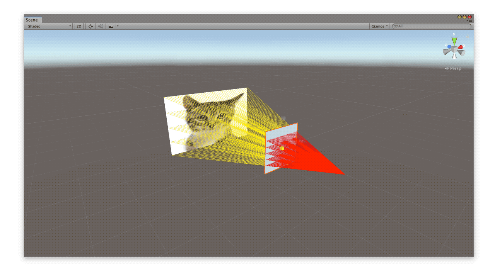
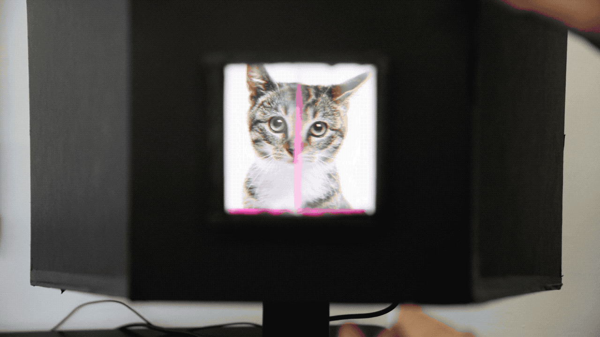
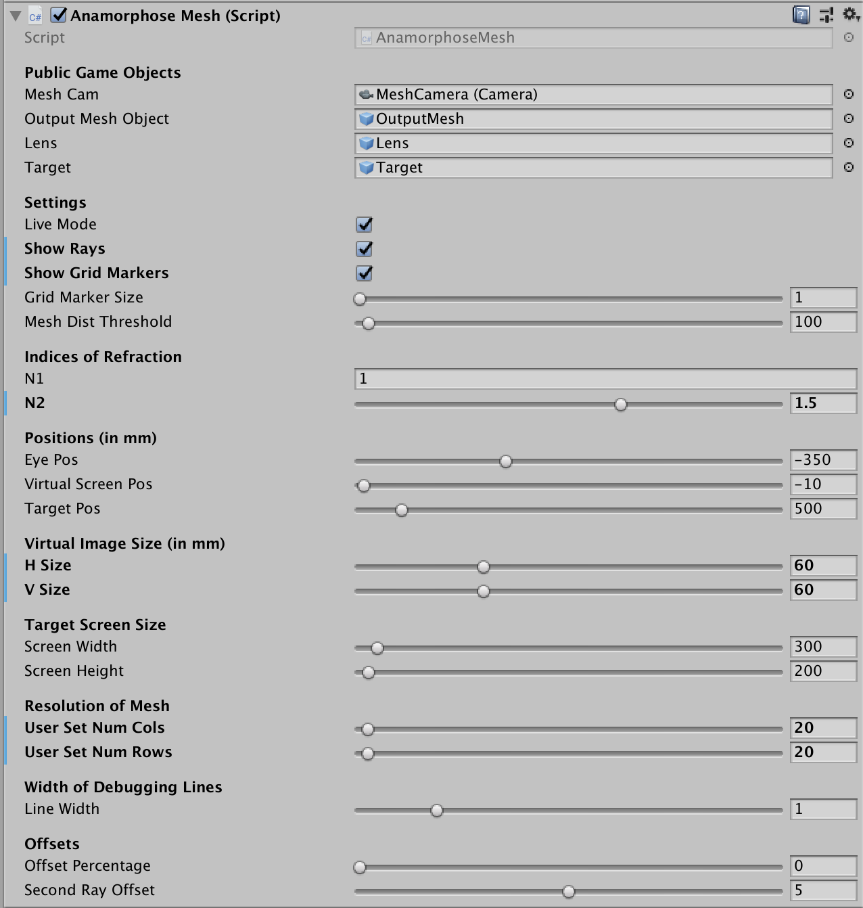

# anamorphose-utility
This is a tool for performing dioptric (refractive, lens-based) anamorphoses.  This means that it is able to distort an image such that it can only be seen through a particular lens.  

Start with:
* a 3D model of a lens for which you would like to compute the corresponding anamorphosis
* the position of a viewer's eye
* the position of the 'target' (the monitor or projection surface)

### Demo:

In Unity:

In real life:

### Parameters:

**Live Mode**: if checked, recalculates the anamorphosis every frame

**Show Rays**: if checked, shows debugging lines in the scene view

**Show Grid Markers**: if checked, shows debugging grid points for the virtual image and distorted image

**Grid Marker Size**: size of grid markers (if *Show Grid Markers* is checked)

**Mesh Dist Threshold**: if the refracted mesh is folded, some parts of the mesh will overlap others, obscuring the desired image.  This setting prevents  these issues by setting a maximum distance threshold between any two triangle indices on the mesh.  Any triangles with points at a greater value than this threshold will be thrown out.  Play with this setting (in *Live Mode*) until the refracted image looks good.

**Indices of Refraction**: N1 is index of refraction of air (should be 1).  Adjust N2 to match the index of refraction of your lens material

**Positions (in mm)**: eye, lens, and target are lined up along Z axis

**Virtual Image Size (in mm)**: set these values as large as you can such that the rays still go through the lens

**Target Screen Size**: set these values to the size of your target screen on which the anamorphic image will be presented

**Resolution of Mesh**: set these values as high as seems necessary to achieve an accurate anamorphosis.  If this is being performed in real-time, lower settings will be necessary

**Width of Debugging Lines**: set the value of debugging lines in scene view (only if *Show Rays* is checked)

**Offset Percentage**: Probably don't touch this... 

**Second Ray Offset**: Adjust this if things are acting up...

# References

This tool is based on the POV-Ray tool by Francesco De Comité found [here](https://www.lifl.fr/~decomite/anamorphoses/tutorial/tutorial.html).